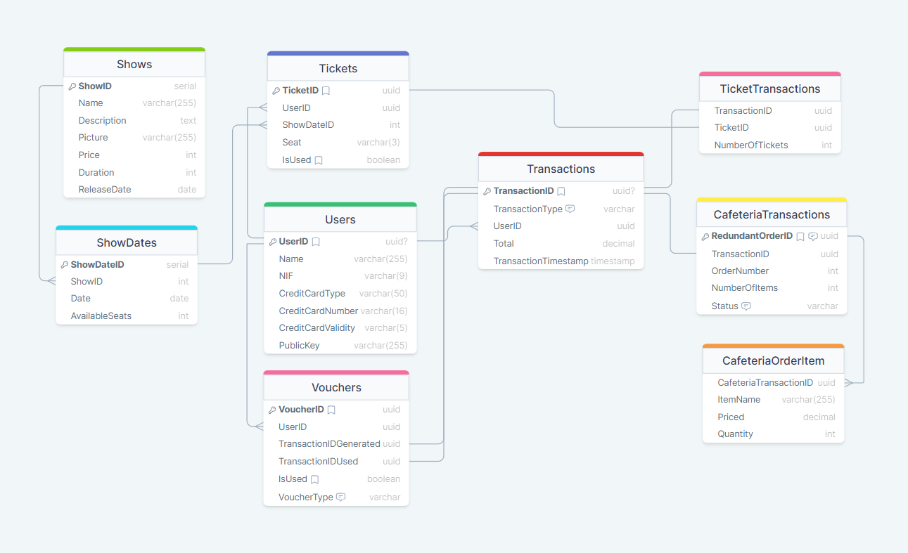

# Ticket and Cafeteria Ordering System

## Group Composition

| Name | Email | GitHub |
| --- | --- | --- |
| Carlos Veríssimo | up201907716@up.pt | [carlosverissimo3001](https://github.com/carlosverissimo3001)
| Nuno Jesus | up201905477@up.pt | [Nuno-Jesus](https://github.com/Nuno-Jesus)

The systems is comprised by 4 main components:

## Architecture of the system

| Component | Description |
| --- | --- |
| **TheaterLink** | Is the backend service. Interacts with the database and provides the API for the frontend. Written in Python using Flask. |
| **TheaterPal** | The main application. Allows users to consult shows, buy tickets, buy food from the cafeteria among other features. Developed with Kotlin |
| **TheaterValid8** | The validation app for the tickets. Reads tickets using NFC from the customers and validates them. Developed with Kotlin |
| **TheaterBite** | The cafeteria terminal app that receives orders from the customers also using NFC. Developed with Kotlin |

### TheaterLink

<!-- TODO: Describe the backend service -->

- To unclutter the main application, [app.py](../TheaterLink/app.py), endpoints were separated into different files. Each file is responsible for a different set of endpoints.

#### User Endpoints

[user.py](../TheaterLink/routes/users.py) contains the endpoints for user management. It allows the creation of new users, login, and user information retrieval.

- API endpoints:
  - `POST /register` - Register a new user
  - `GET /get_user` - Get user information given an ID
  - `GET /users` - Get all users (unused//debugging purposes)

[shows.py](../TheaterLink/routes/shows.py) contains the endpoints for show management. It allows the retrieval of all shows that were previously added to the database (during creation).

- API endpoints:
  - `GET /shows` - Get all shows

[tickets.py](../TheaterLink/routes/tickets.py) contains the endpoints for ticket management. It allows the creation of new tickets, retrieval of all tickets, and ticket validation.

- API endpoints:
  - `POST /purchase_ticket` - Purchase a ticket
    - Request body:

      ```json
      {
        "show_date_id": "int",
        "user_id": "string",
        "num_tickets": "int",
      }
      ```

    - The response will contain the tickets in the following format:

      ```json
      {
        "tickets": [
          {
            "ticketid": "string",
            "userid": "string",
            "date": "string",
            "price": "int",
            "seat": "string",
            "showname": "string"
          }
        ]
      }
      ```

    - On top of that, a vouchers array will be returned, as per each ticket that was purchased, a voucher will be generated. The vouchers are in the following format:

      ```json
      {
        "vouchers": [
          {
            "voucherid": "string",
            "vouchertype": "string",
            "userid": "string"
          }
        ]
      }
      ```

    - Voucher type are either "free popcorn" or "free coffee", chosen randomly. A 5% voucher discount is also generated if the total price of the tickets is greater than 200.

  - `GET /tickets` - Get all tickets
  - `POST /validate_ticket` - Validate a ticket
  - `POST /set_ticket_as_used` - Set a ticket as used

[vouchers.py](../TheaterLink/routes/vouchers.py) contains the endpoints for voucher management.

- API endpoints:
  - `GET /vouchers` - Get all vouchers for a user

[transactions.py](../TheaterLink/routes/transactions.py) contains the endpoints for transaction management. It allows the retrieval of all transactions and other transaction-related operations.

- API endpoints:
  - `GET /transactions` - Get all transactions
    - The response will contain the transactions in the following format:

      ```json
      {
        "transactions": [
          {
            "timestamp": "timestamp",
            "transactionid": "string",
            "transactiontype": "string",
            "total": "double",
            "vouchers_generated": [
                {
                    "voucherid": "string",
                    "vouchertype": "string",
                    "userid": "string",
                    "isuused": "bool"
                }
            ],
            "items" : [
                // IF TYPE IS TICKET PURCHASE
                {
                    "date": "string",
                    "num_tickets": "int",
                    "price": "double",
                    "shownname": "string",
                },
                // IF TYPE IS FOOD PURCHASE
                {
                    "foodname": "string",
                    "price": "double",
                }
                {}
            ]
            ]
          }
        ]
      }
      ```


### TheaterPal

<!-- TODO: Describe the frontend application -->

### TheaterValid8

<!-- TODO: Describe the ticket validation app -->

### TheaterBite

<!-- TODO: Describe the cafeteria terminal app -->

## Database and Data Schemes

The database used in this project is PostgreSQL and we used the [`psycopg2`](https://pypi.org/project/psycopg2/) library to interact with it, in the backend service.

We used [ElephantSQL](https://www.elephantsql.com/) to host the database.

The database diagram is as follows:

<!-- <p align="center">
  
</p> -->

<iframe width="100%" height="500px" style="box-shadow: 0 2px 8px 0 rgba(63,69,81,0.16); border-radius:15px;" allowtransparency="true" allowfullscreen="true" scrolling="no" title="Embedded DrawSQL IFrame" frameborder="0" src="https://drawsql.app/teams/carlos-verissimos-team/diagrams/theaterdb/embed"></iframe>

It is composed by 9 tables:

### Users

Contains the information of the users that are registered in the system.

| Column | Type | Description | Notes |
| --- | --- | --- | --- |
| `UserID` | UUID | The user's ID, generated by the system | |
| `Name` | VARCHAR(255) | The user's name | |
| `NIF` | VARCHAR(9) | The user's NIF (Fiscal Identification Number) | |
| `CreditCardType` | VARCHAR(50) | The user's credit card type (VISA, MasterCard, etc.) | |
| `CreditCardNumber` | VARCHAR(16) | The user's credit card number | |
| `CreditCardValidity` | VARCHAR(5) | The user's credit card expiration date (MM/YY) | |
| `PublicKey` | VARCHAR(255) | The user's public key | This is transmitted from the client to the server and then used for verifying signatures |

### Shows

Contains the information of the shows that are available for purchase.

| Column | Type | Description | Notes |
| --- | --- | --- | --- |
| `Showid` | SERIAL | The show's ID, incremented by the system | |
| `Name` | VARCHAR(255) | The show's name | |
| `Description` | TEXT | The show's description | |
| `Picture` | VARCHAR(255) | The show's picture internal URL | |
| `Price` | INT | The price of the tickets for the show | |
| `Duration` | INT | The duration of the show in minutes | |
| `ReleaseDate` | DATE | The date the show was released | |

### ShowDates

Contains the dates that a show is available.

| Column | Type | Description | Notes |
| --- | --- | --- | --- |
| `ShowDateID` | SERIAL | The show date's ID, incremented by the system | |
| `ShowID` | INT | The show's ID | Foreign key to the `Shows` table |
| `Date` | DATE | The date the show is available | |
| `AvailableSeats` | INT | The number of available seats for the show | Not used in the current implementation |

### Transactions

Contains the information of the transactions that were made.

The type of the transaction is an ENUM with the following values: `TICKET_PURCHASE`, `CAFETERIA_ORDER`.

| Column | Type | Description | Notes |
| --- | --- | --- | --- |
| `TransactionID` | UUID | The transaction's ID, generated by the system | |
| `UserID` | UUID | The user's ID | Foreign key to the `Users` table |
| `TransactionType` | transaction_type | The type of the transaction | |
| `Total` | DOUBLE | The total amount of the transaction | |
| `TransactionTimestamp` | TIMESTAMP | The timestamp of the transaction | |

### Tickets

Contains the information of the tickets that were purchased.

| Column | Type | Description | Notes |
| --- | --- | --- | --- |
| `TicketID` | UUID | The ticket's ID, generated by the system | |
| `UserID` | UUID | The user's ID | Foreign key to the `Users` table |
| `ShowDateID` | INT | The show date's ID | Foreign key to the `ShowDates` table |
| `Seat` | VARCHAR(5) | The seat allocated to the ticket | |
| `isUsed` | BOOLEAN | Whether the ticket was used or not | Default is `FALSE` |

### Vouchers

Contains the information of the vouchers that were generated.

The type of the voucher is an ENUM with the following values: `FREE_POPCORN`, `FREE_COFFEE`, `FIVE_PERCENT`.

| Column | Type | Description | Notes |
| --- | --- | --- | --- |
| `VoucherID` | UUID | The voucher's ID, generated by the system | |
| `UserID` | UUID | The user's ID | Foreign key to the `Users` table |
| `VoucherType` | voucher_type | The type of the voucher | |
| `isUsed` | BOOLEAN | Whether the voucher was used or not | Default is `FALSE` |
| `TransactionIDGenerated` | UUID | The transaction that generated the voucher | Foreign key to the `Transactions` table |
| `TransactionIDUsed` | UUID | The transaction in which the voucher was used | Foreign key to the `Transactions` table |

### TicketTransactions

Contains the information of the tickets that were purchased in a transaction.

| Column | Type | Description | Notes |
| --- | --- | --- | --- |
| `TransactionID` | UUID | The transaction's ID | Foreign key to the `Transactions` table |
| `TicketID` | UUID | The ticket's ID | Foreign key to the `Tickets` table |
| `NumberOfTickets` | INT | The number of tickets purchased | |

Note: If more than one ticket was purchased in a transaction, the ticket ID will be set to the first ticket purchased and the number of tickets will be the total number of tickets purchased.

### CafeteriaTransactions

Contains the information of the order that was made in the cafeteria.

The status of an order is an ENUM with the following values: `COLLECTED`, `PREPARING`, `READY`, `DELIVERED`.

| Column | Type | Description | Notes |
| --- | --- | --- | --- |
| `TransactionID` | UUID | The transaction's ID | Foreign key to the `Transactions` table |
| `RedundantOrderID` | UUID | A redundant order ID | |
| `OrderNumber` | INT | The order number | Will be used to identify the order in the cafeteria |
| `NumberOfItems` | INT | The number of items in the order | |
| `Status` | order_status | The status of the order | |

> Note: The `RedundantOrderID` is needed because `CafeteriaOrderItem` needs to reference the `CafeteriaTransactions` table, and the `TransactionID` is not the primary key there.
> This could have been avoided by using the `TransactionID` as the foreign key in the `CafeteriaOrderItem` table, but we decided to keep the consistency of the database, even if it meant adding redundancy.

### CafeteriaOrderItem

Contains the information of the items that were purcased in an order.

| Column | Type | Description | Notes |
| --- | --- | --- | --- |
| `CafeteriaTransactionID` | UUID | The cafeteria transaction's ID | Foreign key to the `CafeteriaTransactions` table |
| `ItemName` | VARCHAR(255) | The name of the item | |
| `Price` | DOUBLE | The price of the item | |
| `Quantity` | INT | The quantity of the item | |

## Features

## Navigation Map

## Scenario Tests

## How to Use

### TheaterLink

### TheaterPal

### TheaterValid8

### TheaterBite